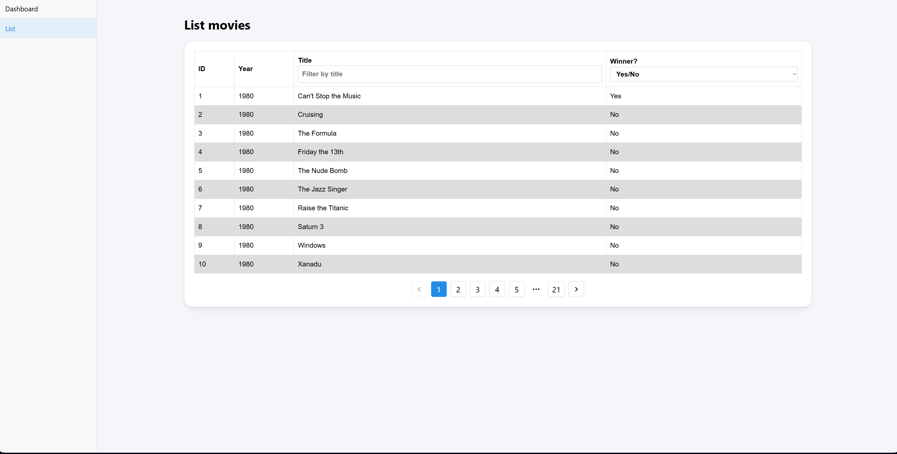

# 🍿 Raspberry Awards - Frontend

Interface web para visualizar dados da premiação Golden Raspberry Awards (categoria _Pior Filme_). Desenvolvido como parte de um desafio técnico front-end.

---

## 🔗 Demo Online

Acesse a demonstração do projeto em produção:

👉 [raspberry-awards.vercel.app](https://raspberry-awards.vercel.app)

> Explore o dashboard interativo, visualize estatísticas da premiação Golden Raspberry Awards e filtre filmes vencedores por ano com uma interface moderna e responsiva.

---

<details>
  <summary>📸 <strong>Ver imagens do projeto</strong></summary>

<br>

### Dashboard


### Lista de Filmes



</details>

---

## 📚 Funcionalidades

### 📊 Dashboard

- Listagem dos anos com múltiplos vencedores
- Top 3 estúdios com mais vitórias
- Produtores com maior e menor intervalo entre vitórias
- Lista de filmes vencedores por ano selecionado

### 🎬 Lista de Filmes

- Paginação de filmes
- Filtro por ano
- Filtro por vencedor (sim/não)

---

## 🚀 Tecnologias Utilizadas

- [React](https://reactjs.org/)
- [TypeScript](https://www.typescriptlang.org/)
- [Mantine UI](https://mantine.dev/)
- [Axios](https://axios-http.com/)
- [Jest](https://jestjs.io/) + [Testing Library](https://testing-library.com/)
- [Vite](https://vitejs.dev/) _(se aplicável)_

---

## 📁 Estrutura de Pastas

```
src/
│
├── components/
│   ├── Dashboard/       # Componentes específicos do Dashboard
│   ├── MovieList/       # Componentes da lista de filmes
│   └── SidebarLayout.tsx
│
├── pages/
│   ├── Dashboard.tsx    # View principal do Dashboard
│   └── Movies.tsx       # View da listagem de filmes
│
├── services/
│   └── movieApi.tsx     # Consumo da API
│
├── tests/               # Testes unitários com Jest
└── styles/              # Estilos globais
```

---

## ⚙️ Como rodar o projeto localmente

### 1. Clonar o repositório

```bash
git clone https://github.com/YagoGodoyGarcia/raspberry-awards.git
cd raspberry-awards
```

### 2. Instalar as dependências

```bash
npm install
```

### 3. Rodar o projeto em modo desenvolvimento

```bash
npm run start
```

Acesse: [http://localhost:3000](http://localhost:3000)

---

## 🧪 Executar os testes

```bash
npm run test
```

---

## 🖼️ Requisitos Atendidos

- [x] Dashboard com 4 painéis conforme especificação
- [x] Filtros e paginação na listagem de filmes
- [x] Responsividade mínima 768x1280
- [x] Testes unitários de componentes
- [x] Código limpo, legível e modular
- [x] Documentação clara

---

## 🔗 API de Dados

Fornecida via: [https://challenge.outsera.tech/api/movies](https://challenge.outsera.tech/api/movies)

---

## ✨ Autor

Desenvolvido por **Yago Godoy Garcia** — [LinkedIn](https://www.linkedin.com/in/yago-godoy-204016130)
